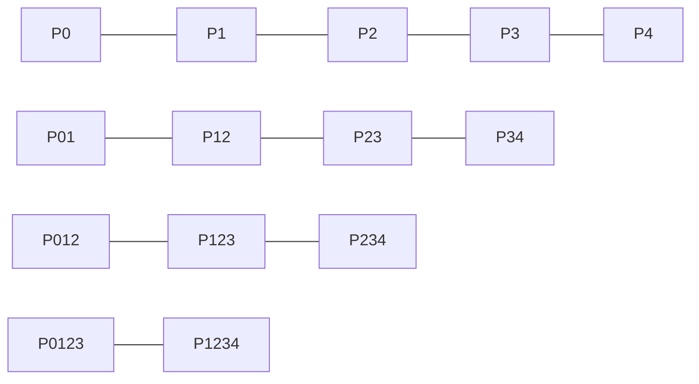

import { Callout, Steps, Step } from "nextra-theme-docs";

# N-Degree Bézier Curves

While quadratic and cubic Bézier curves are the most commonly used in computer graphics and design, Bézier curves can be generalized to any degree. An n-degree Bézier curve is defined by n+1 control points, providing more flexibility in shaping the curve at the cost of increased complexity.

## Constructing N-Degree Bézier Curves

To create an n-degree Bézier curve, we follow the same principle as with lower-degree curves: recursively interpolate between control points until a single point remains. This process is known as **De Casteljau's algorithm**.

<Steps>
### Step 1

Given n+1 control points, linearly interpolate between each pair of adjacent points, resulting in n intermediate points.

### Step 2

Repeat the linear interpolation process on the intermediate points until a single point remains. This point lies on the Bézier curve.

### Step 3

Vary the parameter t from 0 to 1 to trace out the entire Bézier curve.
</Steps>

The following diagram illustrates the construction of a 4-degree Bézier curve:

## Mathematical Representation

An n-degree Bézier curve can be expressed using the **Bernstein polynomial** form:

$B(t) = \sum_{i=0}^{n} \binom{n}{i} (1-t)^{n-i} t^i P_i$

where:
- $P_i$ are the control points
- $t$ is the parameter varying from 0 to 1
- $\binom{n}{i}$ is the binomial coefficient

The Bernstein polynomials act as blending functions, determining the influence of each control point on the curve at a given value of t.

## Limitations of Higher-Degree Bézier Curves

While n-degree Bézier curves offer more control over the shape of the curve, they come with some limitations:

- **Lack of local control**: Moving a single control point affects the entire curve, making it difficult to make precise local adjustments.
- **Computational complexity**: As the degree of the curve increases, so does the computational cost of evaluating and rendering the curve.
- **Numerical instability**: Higher-degree curves can suffer from numerical instability, especially when control points are close together.

<Callout type="info">
Due to these limitations, it is often preferable to use [Bézier splines](/bezier-splines) instead of high-degree Bézier curves when more complex shapes are required.
</Callout>

By understanding the construction and properties of n-degree Bézier curves, you can make informed decisions about when and how to use them in your projects.