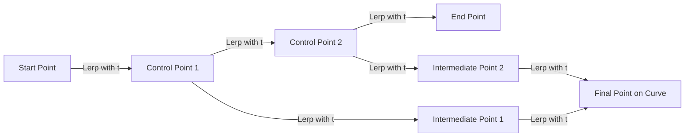

import { Callout, Steps, Step } from "nextra-theme-docs";

# Quadratic and Cubic Bézier Curves

Quadratic and cubic Bézier curves are the workhorses of the Bézier curve family. They offer a perfect balance between simplicity and flexibility, making them ideal for a wide range of applications in computer graphics and design.

## Quadratic Bézier Curves

A quadratic Bézier curve is defined by three control points: a start point, an end point, and a single control point that influences the curve's shape. To construct a quadratic Bézier curve, we follow these steps:

<Steps>
### Step 1

Perform linear interpolation (lerp) between the start point and the control point, and between the control point and the end point, for a given parameter $t$ (usually in the range [0, 1]).

### Step 2

Perform a second lerp between the two points obtained in Step 1, using the same parameter $t$. The resulting point lies on the quadratic Bézier curve.
</Steps>

By varying the parameter $t$ from 0 to 1, we trace out the entire quadratic Bézier curve. The curve always passes through the start and end points, while the control point "pulls" the curve towards itself, influencing its shape.

<Callout>
Quadratic Bézier curves are particularly useful for creating simple, smooth curves with a single point of control.
</Callout>

## Cubic Bézier Curves

Cubic Bézier curves take things a step further by introducing an additional control point. They are defined by four points: a start point, an end point, and two control points that influence the curve's shape. Constructing a cubic Bézier curve follows a similar process to quadratic curves:

<Steps>
### Step 1

Perform linear interpolation between each pair of adjacent points (start point to first control point, first control point to second control point, and second control point to end point) for a given parameter $t$.

### Step 2

Perform two more rounds of linear interpolation on the resulting points from Step 1, using the same parameter $t$.

### Step 3

Perform a final linear interpolation between the two points obtained in Step 2. The resulting point lies on the cubic Bézier curve.
</Steps>

By varying $t$ from 0 to 1, we trace out the entire cubic Bézier curve. Like quadratic curves, cubic curves always pass through the start and end points, while the two control points influence the curve's shape.

Cubic Bézier curves offer more flexibility and control than their quadratic counterparts, making them the go-to choice for many applications, such as:

- Defining paths in vector graphics software (e.g., Adobe Illustrator, Inkscape)
- Creating smooth animations in web design and user interfaces
- Modeling curves and surfaces in 3D graphics and CAD software

<Callout>
The additional control point in cubic Bézier curves allows for more complex and expressive shapes compared to quadratic curves.
</Callout>

To learn more about the mathematical foundations of Bézier curves, check out the [Lerp](/bezier-curves/lerp) section. For a deeper dive into the world of Bézier splines and their applications, head over to the [Bézier Splines](/bezier-splines) section.