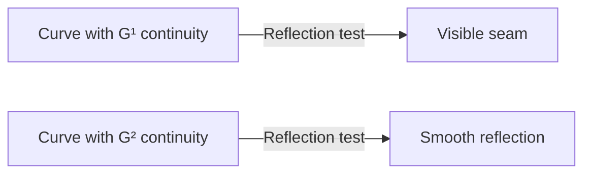

import { Callout, Steps, Step } from "nextra-theme-docs";

# Geometric Continuity

In the world of splines, geometric continuity is a crucial concept that ensures the smoothness and aesthetic appeal of curves, particularly in industrial design and reflective surfaces. While [parametric continuity](/continuity/parametric-continuity) focuses on the continuity of derivatives with respect to the parameter, geometric continuity is concerned with the visual smoothness of the curve, independent of the parameterization.

## G¹ Continuity (Tangent Continuity)

G¹ continuity, also known as tangent continuity, is achieved when the tangent vectors at the joint between two curve segments are aligned. This means that the curves share the same tangent direction at the point of connection, creating a visually smooth transition.

To achieve G¹ continuity in Bézier splines, we need to align the tangent points, which are the control points adjacent to the shared endpoint. Mathematically, this can be expressed as:

$P_4 = P_3 + \beta_1(P_3 - P_2)$

where $P_4$ is the tangent point of the second curve segment, $P_3$ is the shared endpoint, $P_2$ is the tangent point of the first curve segment, and $\beta_1$ is a scalar value that determines the length of the tangent vector.

<Callout>
  It's important to note that G¹ continuity does not guarantee a smooth transition in terms of speed or curvature. The curve may still have a visible kink or change in curvature at the joint.
</Callout>

## G² Continuity (Curvature Continuity)

G² continuity, or curvature continuity, takes smoothness a step further by ensuring that the curvature at the joint between two curve segments is continuous. This is particularly important for reflective surfaces, such as car bodies or phone designs, where discontinuities in curvature can create visible seams or distortions in the reflection.

To analyze G² continuity, we can use the **curvature comb**, a visual tool that represents the curvature at each point along the curve. When G² continuity is achieved, the curvature comb will be aligned and connected across the joint, indicating a smooth transition in curvature.

<Steps>
### Step 1: Align tangent points

To achieve G² continuity, we first need to ensure G¹ continuity by aligning the tangent points as described in the previous section.

### Step 2: Constrain the second tangent point

In addition to aligning the tangent points, we need to constrain the position of the second tangent point ($P_5$) to achieve curvature continuity. This constraint introduces an additional degree of freedom, denoted as $\beta_2$.

</Steps>

By applying these constraints, we can create splines with G² continuity, ensuring a visually smooth transition in both tangent direction and curvature.

## The Reflection Test

A practical way to evaluate the geometric continuity of a curve is to perform the reflection test. This involves creating a reflective surface based on the curve and observing how a reflected pattern or environment behaves across the joint.

If the reflection shows a visible seam or distortion at the joint, it indicates that the curve has only G¹ continuity. On the other hand, if the reflection appears smooth and continuous, the curve likely possesses G² continuity.

<Callout>
  The reflection test is a powerful tool for designers and artists to assess the quality of their curves and surfaces, ensuring that the final product meets the desired level of smoothness and aesthetic appeal.
</Callout>

By understanding and applying the principles of geometric continuity, you can create visually pleasing and smooth splines that are well-suited for various applications, from industrial design to computer graphics and animation.