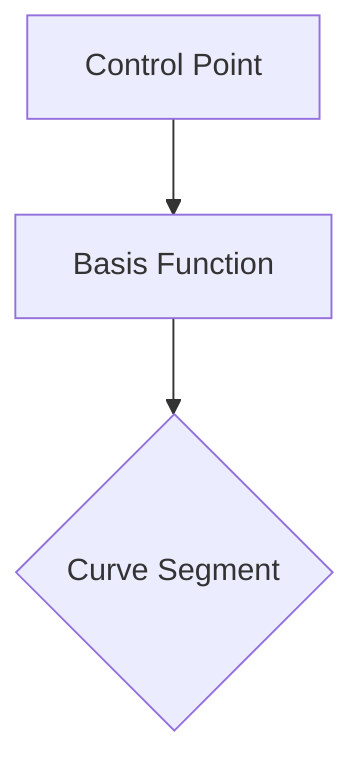

import { Callout, Steps, Step } from "nextra-theme-docs";

# Cardinal and Catmull-Rom Splines

Cardinal and Catmull-Rom splines are variations of [Hermite splines](/extended-spline-universe/hermite-splines) that automatically calculate tangents based on neighboring control points. This makes them easy to use and control, as you only need to provide the control points without explicitly specifying the tangents.

## Cardinal Splines

Cardinal splines use a simple method to calculate tangents:

<Steps>
### Step 1

Draw a vector between the neighboring points of each control point.

### Step 2

Use that vector as the tangent for the corresponding control point.
</Steps>

This process is repeated for every control point, creating a smooth curve that passes through all the control points.

However, the resulting curve may have some issues, such as:
- Not passing through the endpoints (because they're missing one of their neighbors)
- Sharp turns or flat sections, leading to uneven curvature

To address the endpoint problem, we can create "ghost points" by mirroring the second and second-to-last points. This allows the curve to extend to the endpoints.

The sharp turns and flat sections can be mitigated by introducing a *tension* parameter, which scales the tangent vectors. A lower tension value will result in a more relaxed curve, while a higher value will create sharper turns.

<Callout>
The tension parameter gives you control over the sharpness of the curve, allowing you to find the right balance between smoothness and precision.
</Callout>

## Catmull-Rom Splines

The Catmull-Rom spline is a special case of the Cardinal spline where the tension is set to 0.5. This value strikes a balance between smoothness and preserving the shape of the control polygon.

Some key properties of Catmull-Rom splines include:
- Passing through all control points (except the endpoints, which may require special handling)
- C¹ continuity, meaning the first derivative (velocity) is continuous
- G¹ continuity, meaning the tangent direction is continuous
- Automatic tangent calculation, making them easy to use

The Catmull-Rom spline is one of the most popular splines in game development due to its simplicity and smooth results. It's particularly useful for path smoothing, where passing through exact points is important.

## Basis Functions and Continuity

We can analyze the basis functions of Cardinal and Catmull-Rom splines to understand their continuity properties. The basis functions represent the influence of each control point on the resulting curve.

By examining the continuity of these basis functions, we can determine the overall continuity of the spline. For example, if the basis functions are C¹ continuous, the resulting spline will also be C¹ continuous.

<Callout>
Understanding the basis functions of a spline can provide insights into its continuity and behavior.
</Callout>

In conclusion, Cardinal and Catmull-Rom splines offer a balance between ease of use and smoothness, making them popular choices for various applications in computer graphics and game development.